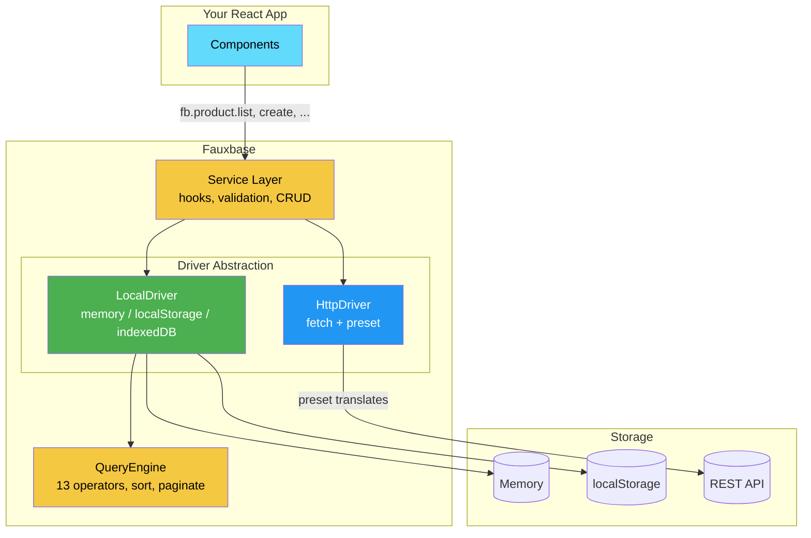
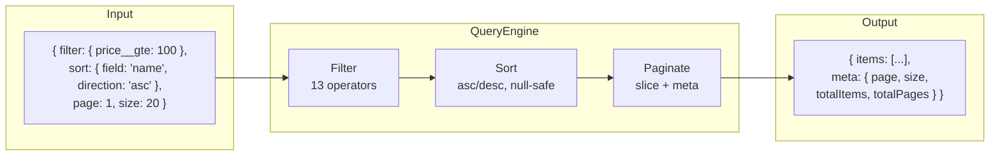
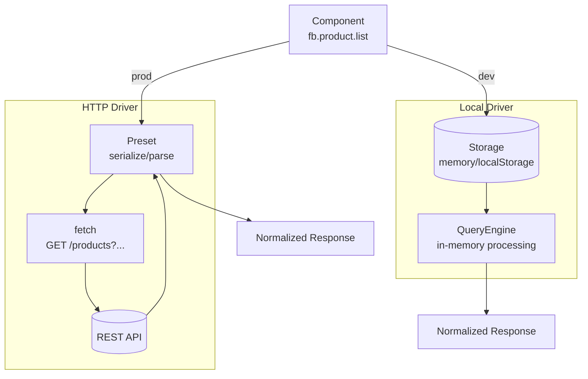
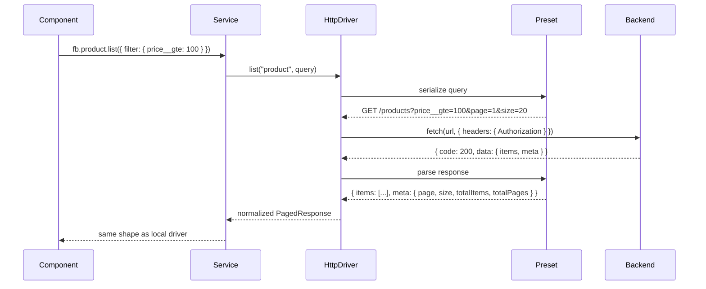
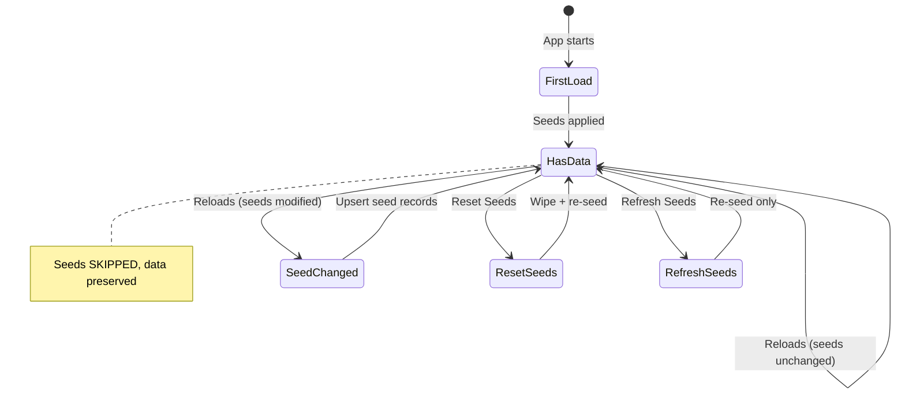
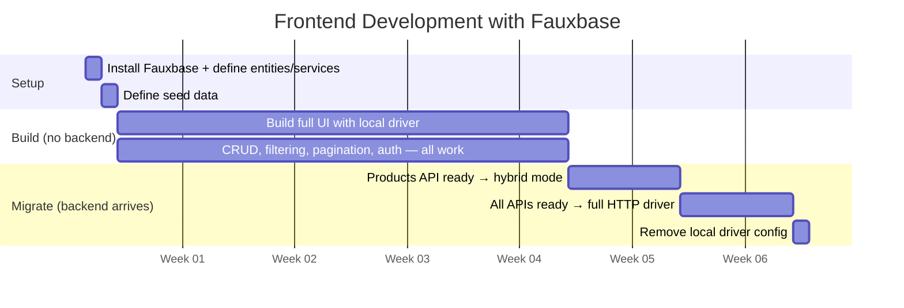

# Fauxbase

**Start with fake. Ship with real. Change nothing.**

A frontend data layer that simulates your backend — entities, services, business logic, 13 query operators, auth, role-based access — all running in the browser. When your backend is ready, swap one config line.

```
npm install @fauxbase/core
```

---

## The Problem

Every frontend project does this:

```
1. Backend not ready       → hardcode mock data in components
2. Mock data grows         → copy-paste, no structure, spaghetti
3. Need filtering/search   → hack together Array.filter()
4. Need pagination         → hack together Array.slice()
5. Need auth               → fake login with useState
6. Backend arrives         → REWRITE all data fetching
7. Partial backend         → half mock, half real, chaos
8. Migration bugs          → deadline missed
```

Existing tools don't solve this:

| Tool | What it does | The gap |
|------|-------------|---------|
| **MSW** | Intercepts HTTP at network level | You mock the *transport*, not the *data layer*. No query engine, no auth simulation. |
| **json-server** | Fake REST from a JSON file | No query operators, no auth, no hooks, separate process. |
| **MirageJS** | In-browser mock server | No typed entities, limited query operators, no auth sim, largely abandoned. |
| **Zustand/Redux** | State management | Just state — no CRUD contract, no query engine, no migration path. |

**Fauxbase fills the gap**: a structured, type-safe data layer with query capabilities and auth that runs locally during development and transparently switches to your real backend.

---

## Architecture



**Key insight**: Components always talk to the Service layer. The Service delegates to a Driver. The Driver is swappable. Your components never know whether they're hitting localStorage or a REST API.

---

## Quick Start

### 1. Define your entities

```typescript
import { Entity, field, relation, computed } from '@fauxbase/core';

export class Product extends Entity {
  @field({ required: true })          name!: string;
  @field({ required: true, min: 0 })  price!: number;
  @field({ default: 0 })              stock!: number;
  @field({ default: true })           isActive!: boolean;

  @relation('category')               categoryId!: string;

  @computed(p => p.stock > 0 && p.isActive)
  available!: boolean;
}
```

The `Entity` base class gives you these fields automatically:

| Field | Type | Description |
|-------|------|-------------|
| `id` | `string` | Auto-generated UUID |
| `createdAt` | `string` | ISO timestamp, set on create |
| `updatedAt` | `string` | ISO timestamp, updated on every change |
| `createdById` | `string?` | User who created (when auth active) |
| `createdByName` | `string?` | Display name of creator |
| `updatedById` | `string?` | User who last updated |
| `updatedByName` | `string?` | Display name of updater |
| `deletedAt` | `string?` | Soft delete timestamp (null = not deleted) |
| `version` | `number` | Auto-incremented on every update |

### 2. Define services with business logic

```typescript
import { Service, beforeCreate, beforeUpdate } from '@fauxbase/core';
import { Product } from './entities/product';

export class ProductService extends Service<Product> {
  entity = Product;
  endpoint = '/products';

  @beforeCreate()
  ensureUniqueName(data: Partial<Product>, existing: Product[]) {
    if (existing.some(p => p.name === data.name)) {
      throw new ConflictError(`Product "${data.name}" already exists`);
    }
  }

  @beforeUpdate()
  preventNegativeStock(_id: string, data: Partial<Product>) {
    if (data.stock !== undefined && data.stock < 0) {
      throw new ValidationError('Stock cannot be negative');
    }
  }

  // Custom methods — available on both drivers
  async getByCategory(categoryId: string, page = 1) {
    return this.list({
      filter: { categoryId, isActive: true },
      sort: { field: 'name', direction: 'asc' },
      page, size: 20,
    });
  }
}
```

Services give you:

| Method | Description |
|--------|-------------|
| `list(query)` | Filtered, sorted, paginated list |
| `get(id)` | Get by ID |
| `create(data)` | Create with hooks + validation |
| `update(id, data)` | Update with hooks |
| `delete(id)` | Soft delete |
| `count(filter?)` | Count matching records |
| `bulk.create([])` | Batch insert |
| `bulk.update([])` | Batch update |
| `bulk.delete([])` | Batch delete |

### 3. Define seed data

```typescript
import { seed } from '@fauxbase/core';
import { Product } from './entities/product';

export const productSeed = seed(Product, [
  { name: 'Hair Clay', price: 185000, categoryId: 'seed:category:0', stock: 50 },
  { name: 'Beard Oil', price: 125000, categoryId: 'seed:category:1', stock: 30 },
]);
```

### 4. Create the client

```typescript
import { createClient } from '@fauxbase/core';

export const fb = createClient({
  driver: import.meta.env.VITE_API_URL
    ? { type: 'http', baseUrl: import.meta.env.VITE_API_URL, preset: 'lightwind' }
    : { type: 'local', persist: 'localStorage' },

  services: {
    product: ProductService,
    category: CategoryService,
    order: OrderService,
  },

  seeds: [categorySeed, productSeed],
});

// Type-safe:
// fb.product.list(...)       → ProductService
// fb.category.get(...)       → CategoryService
// fb.product.getByCategory() → custom method, fully typed
```

### 5. Use it

```typescript
// List with filtering
const result = await fb.product.list({
  filter: { price__gte: 100000, name__contains: 'hair' },
  sort: { field: 'price', direction: 'desc' },
  page: 1,
  size: 20,
});

// Create
const { data } = await fb.product.create({
  name: 'New Product',
  price: 150000,
  categoryId: 'seed:category:0',
});

// Update
await fb.product.update(data.id, { stock: 100 });

// Delete (soft)
await fb.product.delete(data.id);
```

---

## Query Engine — 13 Operators

Every filter operator works identically on the local driver (in-memory) and the HTTP driver (translated to URL params).

```typescript
const result = await fb.product.list({
  filter: {
    price__gte: 100000,                  // price >= 100000
    name__contains: 'pomade',            // case-insensitive substring
    categoryId__in: ['cat-1', 'cat-2'],  // value in list
    stock__between: [10, 100],           // 10 <= stock <= 100
    isActive: true,                      // exact match (eq implied)
    description__isnull: false,          // is not null
  },
  sort: { field: 'price', direction: 'desc' },
  page: 1,
  size: 20,
});
```

### All operators

| Operator | Syntax | Description | Example |
|----------|--------|-------------|---------|
| `eq` | `field` or `field__eq` | Exact match | `{ isActive: true }` |
| `ne` | `field__ne` | Not equal | `{ status__ne: 'deleted' }` |
| `gt` | `field__gt` | Greater than | `{ price__gt: 100 }` |
| `gte` | `field__gte` | Greater than or equal | `{ price__gte: 100 }` |
| `lt` | `field__lt` | Less than | `{ stock__lt: 10 }` |
| `lte` | `field__lte` | Less than or equal | `{ stock__lte: 100 }` |
| `like` | `field__like` | Case-insensitive substring | `{ name__like: 'hair' }` |
| `contains` | `field__contains` | Same as `like` | `{ name__contains: 'hair' }` |
| `startswith` | `field__startswith` | Case-insensitive prefix | `{ name__startswith: 'ha' }` |
| `endswith` | `field__endswith` | Case-insensitive suffix | `{ email__endswith: '@gmail.com' }` |
| `between` | `field__between` | Inclusive range | `{ price__between: [100, 500] }` |
| `in` | `field__in` | Value in list | `{ status__in: ['active', 'pending'] }` |
| `isnull` | `field__isnull` | Null/undefined check | `{ deletedAt__isnull: true }` |

### How queries flow



Soft-deleted records (where `deletedAt` is set) are automatically excluded before any filtering.

---

## Drivers

### Local Driver (development)

Runs entirely in the browser. No server needed.

```typescript
driver: { type: 'local', persist: 'memory' }        // volatile, fastest
driver: { type: 'local', persist: 'localStorage' }   // persists across refresh
```

| Store | Persists? | Limit | Best for |
|-------|-----------|-------|----------|
| `memory` | No | RAM | Unit tests, throwaway demos |
| `localStorage` | Yes | ~5MB | Default, small-medium datasets |

### HTTP Driver (production)

Translates Fauxbase calls to fetch requests. Uses **presets** to speak your backend's language.

```typescript
driver: {
  type: 'http',
  baseUrl: 'https://api.example.com',
  preset: 'lightwind',
}
```

### Hybrid Driver (gradual migration)

When your backend is partially ready — migrate one service at a time:

```typescript
const fb = createClient({
  driver: { type: 'local' },  // default for all

  overrides: {
    product: { driver: { type: 'http', baseUrl: 'https://api.example.com', preset: 'lightwind' } },
    // category, order → still local
  },
});
```

### Driver flow



Components always get the same normalized response shape, regardless of driver.

---

## Backend Presets

A preset tells the HTTP driver how to talk to your backend — how to serialize queries, parse responses, and handle auth.

### Built-in presets

| Preset | Framework | Filter Style | Auth |
|--------|-----------|-------------|------|
| `lightwind` | Lightwind (Quarkus) | `?price__gte=100` | `/auth/login` |
| `spring-boot` | Spring Boot | `?price.gte=100` | `/api/auth/signin` |
| `nestjs` | NestJS | `?filter.price.$gte=100` | `/auth/login` |
| `laravel` | Laravel | `?filter[price_gte]=100` | `/api/login` |
| `django` | Django REST Framework | `?price__gte=100` | `/api/token/` |
| `express` | Express.js | `?price__gte=100` | `/auth/login` |
| `fastapi` | FastAPI | `?price__gte=100` | `/api/auth/token` |
| `rails` | Ruby on Rails | `?q[price_gteq]=100` | `/api/login` |
| `go-gin` | Go (Gin) | `?price__gte=100` | `/api/auth/login` |

### Custom presets

```typescript
import { definePreset } from '@fauxbase/core';

const fb = createClient({
  driver: {
    type: 'http',
    baseUrl: 'https://api.myapp.com',
    preset: definePreset({
      name: 'my-backend',
      response: {
        single: (raw) => ({ data: raw.result }),
        list: (raw) => ({
          items: raw.results,
          meta: {
            page: raw.page,
            size: raw.per_page,
            totalItems: raw.total,
            totalPages: raw.pages,
          },
        }),
      },
      query: {
        filterStyle: 'django',
        pageParam: 'page',
        sizeParam: 'per_page',
      },
      auth: {
        loginUrl: '/api/v1/login',
        tokenField: 'access_token',
      },
    }),
  },
});
```

### How presets work



---

## Seeding Strategy

Seed data and runtime data are tracked separately.



**How it works:**

- Seed records get deterministic IDs: `seed:product:0`, `seed:product:1`, ...
- Runtime records (created during development) get normal UUIDs: `a3f1b2c4-...`
- Fauxbase tracks a `_seedVersion` hash — if your seed definitions change, only seed records are re-applied
- Runtime records are never touched during re-seeding
- On HTTP driver, seeding is disabled entirely — the backend owns the data

---

## Response Format

All operations return a normalized format. Components always see the same shape regardless of driver.

```typescript
// Single item (get, create, update)
interface ApiResponse<T> {
  data: T;
}

// List (list)
interface PagedResponse<T> {
  items: T[];
  meta: {
    page: number;
    size: number;
    totalItems: number;
    totalPages: number;
  };
}

// Errors (thrown as exceptions)
class NotFoundError    // code: 'NOT_FOUND'
class ConflictError    // code: 'CONFLICT'
class ValidationError  // code: 'VALIDATION', details: { field: message }
class ForbiddenError   // code: 'FORBIDDEN'
```

---

## Decorators

### Entity decorators

| Decorator | Purpose | Example |
|-----------|---------|---------|
| `@field(options?)` | Mark entity field with validation | `@field({ required: true, min: 0 })` |
| `@relation(entity)` | Foreign key relation | `@relation('category')` |
| `@computed(fn)` | Derived value, recalculated on access | `@computed(p => p.stock > 0)` |

### Service hook decorators

| Decorator | Signature | Purpose |
|-----------|-----------|---------|
| `@beforeCreate()` | `(data, existingItems) => void` | Validate/mutate before create |
| `@beforeUpdate()` | `(id, data) => void` | Validate/mutate before update |
| `@afterCreate()` | `(entity) => void` | Side effects after create |
| `@afterUpdate()` | `(entity) => void` | Side effects after update |

Hooks can throw errors to abort operations:

```typescript
@beforeCreate()
ensureUnique(data: Partial<Product>, existing: Product[]) {
  if (existing.some(p => p.name === data.name)) {
    throw new ConflictError('Name must be unique');
  }
}
```

---

## The Migration Timeline



```
Week 1:    npm install @fauxbase/core
           Define entities, services, seeds
           Build UI with local driver — everything works

Week 2-4:  Building features at full speed
           No blocking on backend, no mock data spaghetti

Week 5:    "Products API is ready"
           → switch products to HTTP driver (hybrid mode)
           → zero component changes

Week 6:    "All APIs ready"
           → set VITE_API_URL globally
           → done
```

---

## Project Structure

Recommended structure in your app:

```
src/
├── fauxbase/
│   ├── entities/
│   │   ├── product.ts        ← class Product extends Entity
│   │   ├── category.ts
│   │   └── user.ts
│   ├── services/
│   │   ├── product.ts        ← class ProductService extends Service<Product>
│   │   ├── category.ts
│   │   └── user.ts
│   ├── seeds/
│   │   ├── product.ts        ← seed(Product, [...])
│   │   └── category.ts
│   └── index.ts              ← createClient({ ... })
├── components/
│   └── ProductList.tsx        ← fb.product.list({ ... })
└── main.tsx
```

---

## Technical Details

| Aspect | Detail |
|--------|--------|
| **Package** | `@fauxbase/core` (~8KB gzipped) |
| **Runtime deps** | Zero |
| **TypeScript** | First-class, full type inference |
| **Decorators** | `experimentalDecorators` (legacy TS decorators) |
| **Query operators** | 13: eq, ne, gt, gte, lt, lte, like, contains, startswith, endswith, between, in, isnull |
| **Storage** | memory, localStorage (indexedDB planned) |
| **Auth** | Planned (Phase 2) |
| **Presets** | lightwind, spring-boot, nestjs, laravel, express, django, fastapi, rails, go-gin, custom |
| **Build** | tsup (ESM + CJS + DTS) |
| **Tests** | vitest, 140+ tests, 97%+ coverage |

---

## Roadmap

- [x] **v0.1** — Core: Entity, Service, QueryEngine, LocalDriver, Seeds
- [ ] **v0.2** — React hooks (`useList`, `useGet`, `useMutation`, `useAuth`) + Auth simulation
- [ ] **v0.3** — HTTP Driver + Backend Presets + DevTools
- [ ] **v0.4** — IndexedDB, CLI (`npx fauxbase init`), Vue/Svelte adapters

---

## License

MIT
